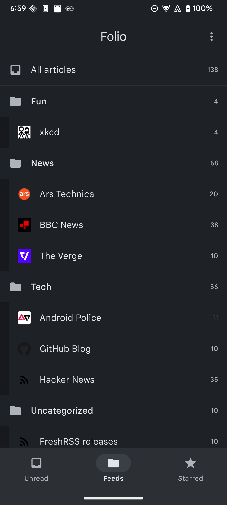
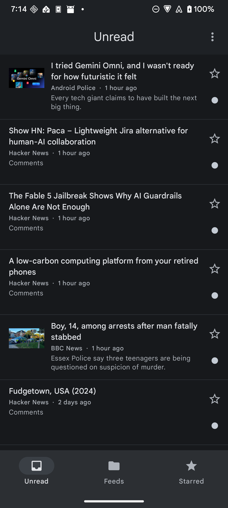
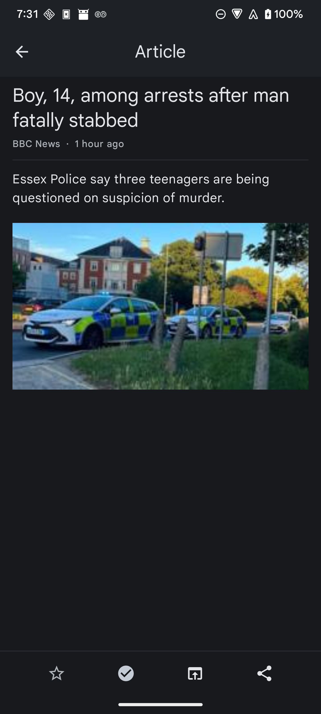

# Folio

A clean, open-source Android reader for your self-hosted [FreshRSS](https://freshrss.org/) server, over the Google Reader API.


Folio connects to a FreshRSS server (or any server that speaks the Google Reader API) and lets you read, organize, and star your feeds. It is built with Jetpack Compose and Material 3, with no proprietary dependencies, no tracking, and no advertising.

> Status: early development (0.2.0). Reading works end to end; more lands phase by phase — see [ROADMAP.md](ROADMAP.md).

## Features

- Sign in to a self-hosted FreshRSS server with your Google Reader API credentials
- Browse subscriptions and categories — All, Unread, Starred, by category, by feed
- An article list with titles, feeds, timestamps, excerpts, thumbnails, and read/unread state, with pull-to-refresh
- A reader view: article HTML rendered with inline images, swipe to next/previous, share, and open in browser
- Mark read/unread and star, written through to your server

Background sync and offline-resilient read/star (changes queue and sync when the connection returns) are in place. Coming next: full offline reading, search, and a selectable appearance (launcher icon + matching theme).

## Screenshots

<p>
  
  
  
</p>

## Build from source

Requirements: JDK 17, the Android SDK, and a device or emulator running Android 8.0 (API 26) or newer.

```bash
git clone <repo-url>
cd Folio
./gradlew assembleDebug
./gradlew installDebug   # install on a connected device
```

The release build compiles from source without any signing secrets (it produces an unsigned APK that can be signed downstream), which keeps the project friendly to F-Droid-style from-source builds.

## License

Folio is free software, licensed under the GNU General Public License v3.0. See [LICENSE](LICENSE).
